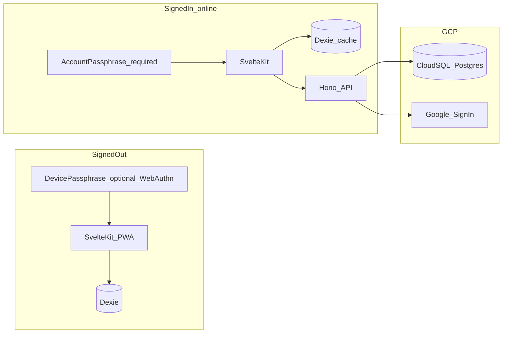

# Architecture

Two modes, one web app. **Signed out:** client-only Dexie PWA, no API. **Signed in:** SvelteKit talks to Hono; Dexie is a cache; Cloud SQL holds ciphertext.

Docs describe the **target**. Specs 117–121 are in the tree: Kit PWA, Cloud Run stubs, wrapping, Google session, and ciphertext sync. Android stays parked (Spec 122).

## Target layout

```text
pocket-ledger/
  apps/web          SvelteKit PWA, adapter-static, path routes, Dexie
  apps/api          Hono (Google ID token → session cookie, sync)
  openapi.yaml
  Dockerfile.web
  Dockerfile.api
```



**Stack:** Svelte 5 + shadcn, Dexie, Hono, Cloud SQL (users, sessions, sync metadata, **bytea** ciphertext), GitHub Actions + Workload Identity Federation.

## Layers

```text
ui            → presentation (Svelte + shadcn)
application   → use cases / orchestration
domain        → pure types & money rules
data          → Dexie, repos, migrations (and later HTTP to Hono)
shared        → cross-cutting helpers (theme, etc.)
```

Paths stay `src/lib/…` until the workspace move (`apps/web`) in Spec 117/118. The layer names do not change.

### Dependency rule

- `ui` may call `application` and read `domain` types
- `application` may call `data` and `domain`
- `domain` depends on nothing (no Dexie, no Svelte, no Hono)
- `data` implements persistence for domain shapes

**UI components must not import Dexie directly.**

## Money

All amounts are **integer minor units**. No floating-point ledger math.

## Double-entry readiness

Simple ledger rows include:

- `accountId`
- `type`: `income` | `expense` | `transfer`
- `counterAccountId` (nullable; destination pocket for transfers)

Do not invent a second parallel storage model when transfers arrive — extend this shape.

## Encryption (DEK wrapping)

ELI5: diary pages use one **metal key** (DEK). Passphrase / hex / WebAuthn are **boxes** around copies of that key. Change password = new box, same key. Email cannot open a box.

Today’s `lock.ts` is **direct derive** (passphrase → AES key). Target (Spec 120 / ADR 0008): random 32-byte DEK + PBKDF2 box key (SHA-256, 600,000 iterations) + AES-GCM wrap in settings (`lock.wrappedDek` / `lock.rawDek`). `field-crypto.ts` still only sees the DEK in RAM.

- Passphrase off: store **raw** DEK in IndexedDB.
- Passphrase on: store salt + wrapped DEK only.
- Set / change / unset = **re-wrap only** — no row rewrite except one-time plaintext migrate.
- Encrypt on write, decrypt **per read**. No whole-table RAM load.
- Client RAM after unlock: DEK. Dropped on screensaver.

**Server may store:** user id, session, `kind`, `id`, `rev`, `deleted`, ciphertext blob, wrap envelopes (salt, kdf id, wrapped DEKs, wrapRev).

**Server never stores:** passphrase, hex kit, raw DEK.

No Cloud KMS envelope. Operator never has the DEK.

## Routing

SvelteKit **path** URLs (Spec 117): `/`, `/activity`, `/pockets`, `/categories`, `/more`. The service worker stays so signed-out still works offline after first load. Unknown paths fall back to the home shell (SPA). Hash bookmarks (`#/activity`) are not preserved.

Panel chrome still lives in `AppShell`; `src/lib/shared/router.ts` maps pathnames to panel ids. Navigation uses SvelteKit `goto`.

## Sync (signed-in, Spec 121)

Unit = one encrypted entity + plain `id`, `kind`, server monotonic `rev`, `deleted`. Save sends the `rev` this device read. Newer server `rev` → **409** → close editor, discard typing, refresh. Deletes are gravestones. Wraps are one account coat-check (`wrapRev`). Pull on unlock, after save, and every 30s while visible and unlocked. No offline mutation queue.

## Testing map

| Layer | Tool |
|-------|------|
| domain / shared | Vitest (node) |
| application (fakes) | Vitest |
| API (Hono, after 119) | Vitest |
| acceptance | Playwright against built preview |
